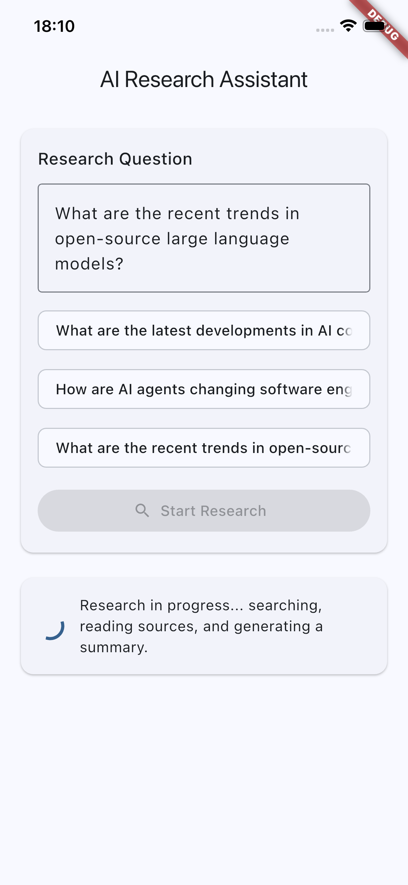
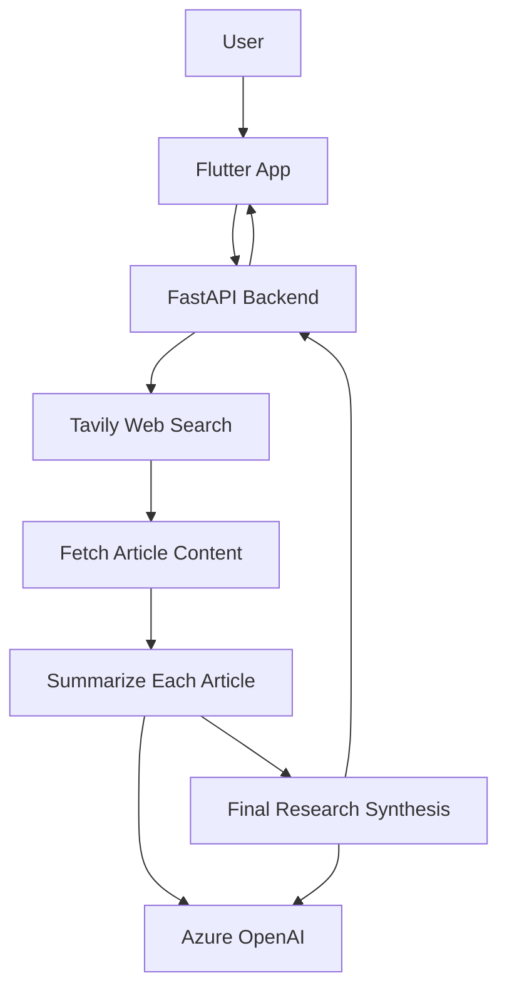

# AI Research Assistant

An end-to-end AI research assistant that searches the web, extracts article content, summarizes each source, and synthesizes a final answer.

Tech stack: **FastAPI + Tavily + Azure OpenAI + Flutter**

Core workflow: `Search → Fetch → Summarize → Synthesize`

---

## Demo

Example question:

> What are the latest developments in AI coding assistants?

The system automatically:

1. Searches the web for relevant sources
2. Extracts and cleans article content
3. Summarizes each article with an LLM
4. Synthesizes a final research summary and key points

Output includes:

- Final summary
- Key points
- Source links
- Article-level summaries

### Mobile UI Screenshot



---

## Architecture

The system implements a structured research pipeline:

Search → Fetch → Summarize → Synthesize



---

## Features

- Web search integration through Tavily
- Automatic article fetching and HTML text extraction
- Article-level summarization with Azure OpenAI
- Final cross-source synthesis with structured output
- Concurrent article processing via `asyncio.Semaphore`
- Flutter-based interactive UI
- Retry and fallback handling for external API failures

---

## Tech Stack

### Backend

- Python 3.11+
- FastAPI
- Tavily Search API
- OpenAI Python SDK (Azure OpenAI endpoint)
- httpx + BeautifulSoup4
- Pydantic / pydantic-settings

### Frontend

- Flutter (Material 3)
- http
- url_launcher

### Tooling

- Ruff (`check` and `format`) for backend linting/formatting
- Flutter Analyze / Flutter Test for frontend checks

---

## Project Structure

```text
ai-research-assistant/
├── backend/
│   ├── app/
│   │   ├── main.py                    # API routes (/, /research)
│   │   ├── agent.py                   # End-to-end research orchestration
│   │   ├── config.py                  # Environment settings and runtime knobs
│   │   ├── schemas.py                 # Request/response models
│   │   ├── logger.py                  # Logger setup
│   │   ├── tools/
│   │   │   ├── search.py              # Tavily search with retries
│   │   │   └── fetch.py               # Article fetching and content extraction
│   │   └── services/
│   │       └── openai_client.py       # Summarize + synthesize calls
│   ├── requirements.txt
│   └── pyproject.toml
├── frontend/
│   ├── lib/
│   │   ├── main.dart
│   │   ├── screens/research_screen.dart
│   │   ├── services/api_service.dart
│   │   └── models/research_response.dart
│   ├── pubspec.yaml
│   └── test/widget_test.dart
├── docs/
│   └── questions.png
└── README.md
```

---

## Backend Setup

```bash
cd backend
python -m venv .venv
source .venv/bin/activate
pip install -r requirements.txt
```

Create `backend/.env`:

```env
TAVILY_API_KEY=your_tavily_api_key
AZURE_OPENAI_API_KEY=your_azure_openai_api_key
AZURE_OPENAI_ENDPOINT=https://your-resource.openai.azure.com
AZURE_OPENAI_DEPLOYMENT=your_deployment_name
```

Start backend:

```bash
uvicorn app.main:app --reload
```

Backend URL: `http://127.0.0.1:8000`

---

## Frontend Setup

```bash
cd frontend
flutter pub get
flutter run
```

Set API base URL with `dart-define`:

```bash
flutter run --dart-define=API_BASE_URL=http://127.0.0.1:8000
```

Android emulator example:

```bash
flutter run --dart-define=API_BASE_URL=http://10.0.2.2:8000
```

If `API_BASE_URL` is not provided, the app uses `http://127.0.0.1:8000` by default.

---

## API Endpoints

### `GET /`

Health check endpoint:

```json
{
  "message": "AI Research Assistant backend is running"
}
```

### `POST /research`

Request:

```json
{
  "question": "What are the latest trends in open source LLMs?"
}
```

Response fields:

- `question`: original question
- `summary`: synthesized final summary
- `key_points`: key findings list
- `sources`: source metadata (`title`, `url`)
- `articles`: per-article details (`title`, `url`, `snippet`, `article_summary`)

---

## Runtime Configuration

Configured in `backend/app/config.py`:

- `research_max_results` (default `3`)
- `fetch_max_chars` (default `8000`)
- `summary_max_input_chars` (default `6000`)
- `article_fetch_timeout_seconds` (default `10.0`)
- `article_min_length` (default `200`)
- `max_article_concurrency` (default `3`)

---

## Quality Checks

Backend:

```bash
cd backend
ruff check .
ruff format .
```

Frontend:

```bash
cd frontend
flutter analyze
flutter test
```

---

## License

MIT
